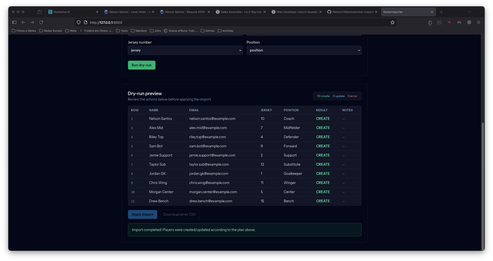

# Roster Importer

Roster Importer is a polished demo app that fuses my two passions: sports and esports with the kind of engineering craft I bring to every build. The project showcases a production-grade Laravel + React stack that ingests roster spreadsheets, validates every row, and lifts the data into a modern coaching workflow. Whether it is a traditional club lineup or a competitive gaming roster, the importer keeps things fast, safe, and coach-friendly.



## What’s Inside

- **Player-first UX:** Upload CSV/XLSX files, map columns, dry-run the changes, then apply them in a single transaction with error CSV exports for any bad rows.
- **Idempotent imports:** File hashes prevent accidental double uploads—perfect for busy tournament days.
- **Import history:** Coaches get the last 10 runs with counts, status, and download links for error reports.
- **Secure authentication:** Laravel Sanctum powers SPA token auth so staff can safely manage sensitive rosters.
- **Tested workflow:** Pest feature tests cover the full happy path and the tricky edge cases (duplicates, validation errors, etc.).

## Stack

| Layer      | Tech                                                                 |
| ---------- | -------------------------------------------------------------------- |
| Backend    | Laravel 12, Laravel Excel, Sanctum, Form Requests, custom services   |
| Frontend   | React 18, Vite, TypeScript, Tailwind CSS 4, React Hook Form, Hot Toast |
| Database   | SQLite locally (MySQL-ready in production)                           |
| Tooling    | Pest, Laravel Pint, GitHub Actions CI                                |

## Getting Up and Running

### Prerequisites
- PHP 8.2+
- Composer 2.6+
- Node.js 20+
- SQLite (bundled) or a MySQL-compatible database

### Installation

```bash
cd roster-importer/api
composer install
npm install

cp .env.example .env
php artisan key:generate
php artisan migrate --database=sqlite
php artisan db:seed
```

### Local Development

```bash
php artisan serve            # API @ http://127.0.0.1:8000
npm run dev -- --host 127.0.0.1  # SPA with hot reload @ http://127.0.0.1:5173
```

Sign in with the seeded coach credentials:

- Email: `coach@example.com`
- Password: `password`

### Useful Commands

```bash
php artisan test        # Run Pest suite
./vendor/bin/pint --test # Enforce code style
npm run build           # Compile production assets (public/build)
```

## Deployment Notes

- **API (Render / Railway / Fly.io):** configure `APP_URL`, database credentials, and run `php artisan migrate --force` on deploy.
- **Frontend (Netlify / Vercel):** `cd roster-importer/api && npm install && npm run build`; publish `roster-importer/api/public` and point it at the deployed API.
- **Auth:** When splitting API and SPA domains, set `SANCTUM_STATEFUL_DOMAINS`, CORS headers, and serve over HTTPS.

## Continuous Integration

`.github/workflows/ci.yml` runs on every push and PR:

1. Installs Composer dependencies and generates the app key.
2. Installs Node dependencies and builds the frontend.
3. Executes Pint in `--test` mode.
4. Runs `php artisan test`.

## Project Layout

```
roster-importer/
├── api/
│   ├── app/              # Domain models, HTTP layer, services
│   ├── database/         # Migrations, factories, seeders
│   ├── resources/js/     # React + Tailwind SPA
│   ├── resources/views/  # Blade bootstrap for the SPA
│   └── tests/            # Pest feature + unit suites
└── docs/                 # Screenshots & UX notes
```

## Seed Data

After `php artisan db:seed` the database includes:

- `Team`: **Skyline FC**
- `User`: `coach@example.com` / `password`

This account powers the SPA login and the automated tests.

---

I love building tools that give coaches, analysts, and team managers their competitive edge. If you’re doing something exciting in sports or esports, let’s build the next play together.